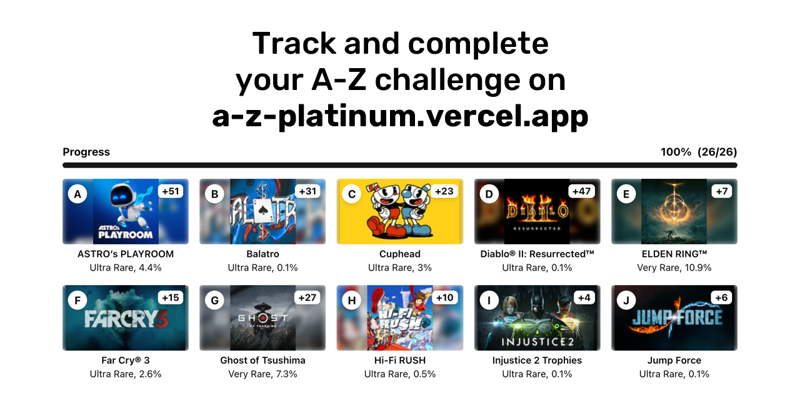

# A-Z Platinum

A-Z Platinum Challenge is a web application for trophy completionists who aim to earn platinum trophies for games starting with every letter from A to Z. This project provides a robust and visually engaging interface to track, organize, and celebrate progress in completing this unique challenge.

[Try it now!](https://a-z-platinum.vercel.app/)

